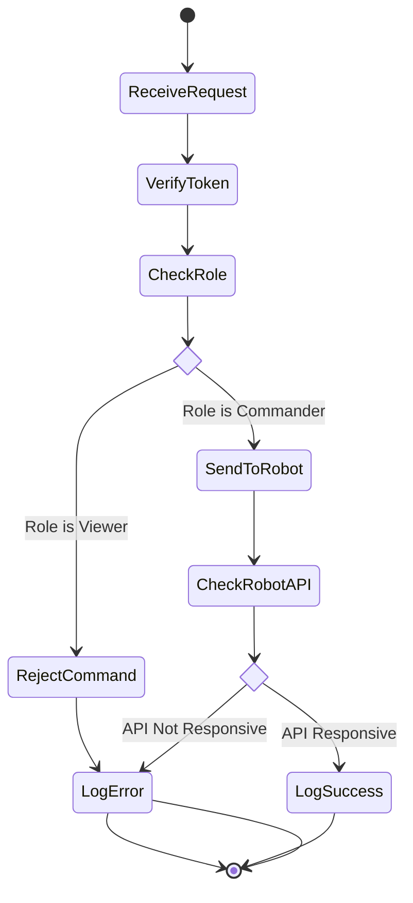

# Activity Diagram

```mermaid
stateDiagram-v2

[*] --> ReceiveRequest
ReceiveRequest --> VerifyToken
VerifyToken --> CheckRole

state decision_role <<choice>>
CheckRole --> decision_role

decision_role --> RejectCommand : Role is Viewer
decision_role --> SendToRobot : Role is Commander

RejectCommand --> LogError
LogError --> [*]

SendToRobot --> CheckRobotAPI

state decision_api <<choice>>
CheckRobotAPI --> decision_api

decision_api --> LogSuccess : API Responsive
decision_api --> LogError : API Not Responsive

LogSuccess --> [*]
LogError --> [*]
```
