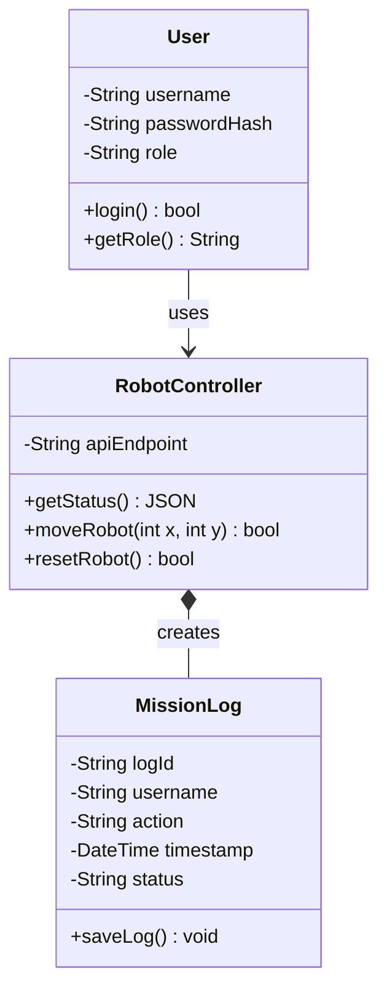

# Class Diagram

```mermaid
classDiagram

class User {
    -String username
    -String passwordHash
    -String role
    +login() bool
    +getRole() String
}

class RobotController {
    -String apiEndpoint
    +getStatus() JSON
    +moveRobot(int x, int y) bool
    +resetRobot() bool
}

class MissionLog {
    -String logId
    -String username
    -String action
    -DateTime timestamp
    -String status
    +saveLog() void
}

User --> RobotController : uses
RobotController *-- MissionLog : creates
```
