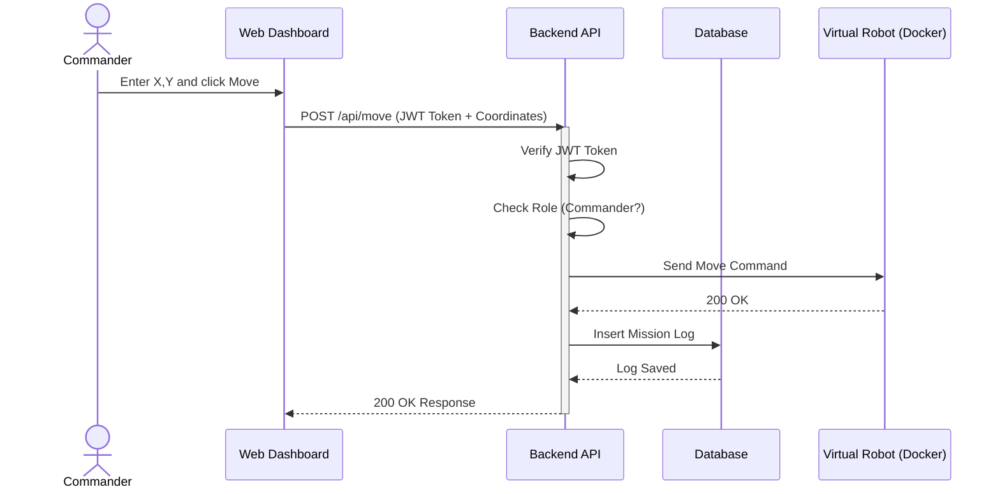

# Sequence Diagram

```mermaid
sequenceDiagram

actor Commander
participant UI as Web Dashboard
participant API as Backend API
participant DB as Database
participant Robot as Virtual Robot (Docker)

Commander->>UI: Enter X,Y and click Move
UI->>API: POST /api/move (JWT Token + Coordinates)

activate API

API->>API: Verify JWT Token
API->>API: Check Role (Commander?)

API->>Robot: Send Move Command
Robot-->>API: 200 OK

API->>DB: Insert Mission Log
DB-->>API: Log Saved

API-->>UI: 200 OK Response

deactivate API
```
