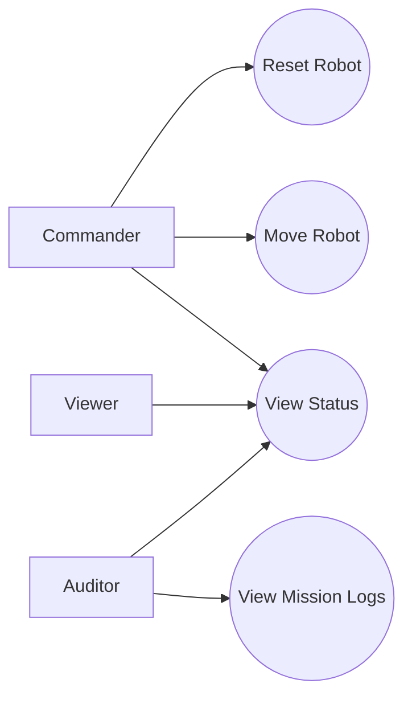

# Use Case Diagram

```mermaid
flowchart LR

%% Actors
C[Commander]
V[Viewer]
A[Auditor]

%% Use Cases
Move((Move Robot))
Status((View Status))
Reset((Reset Robot))
Logs((View Mission Logs))

%% Permissions
C --> Move
C --> Status
C --> Reset

V --> Status

A --> Status
A --> Logs
```
