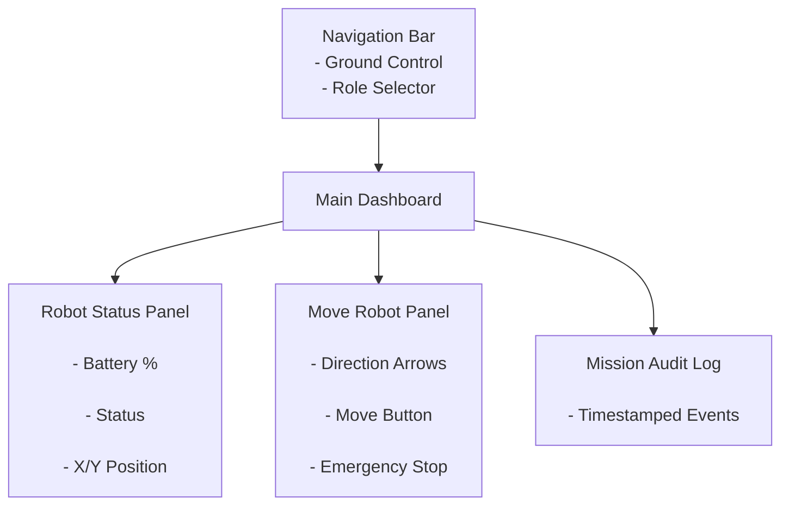
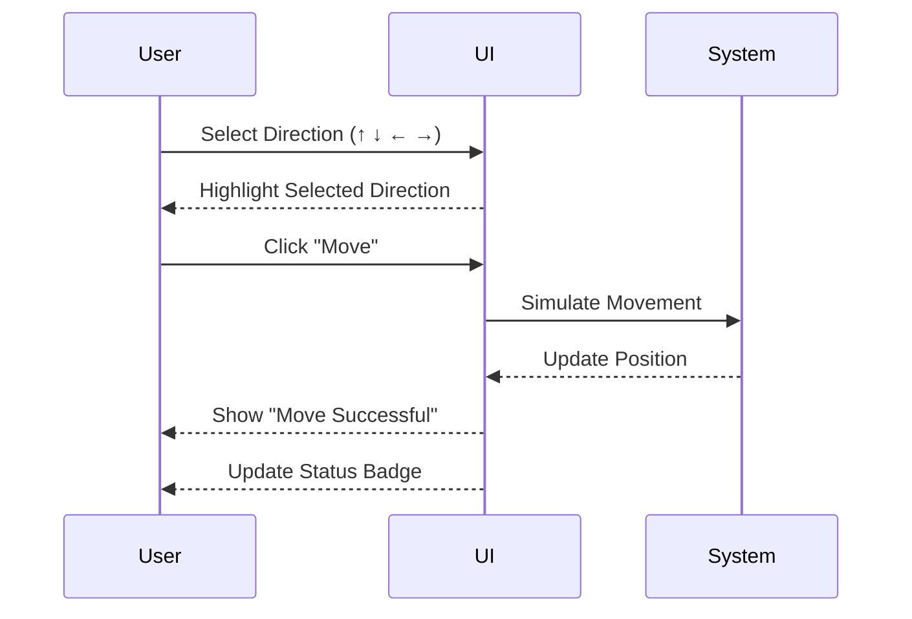

# Ground Control Station – Low Fidelity Wireframe

## Main Dashboard Layout

## Deep Dive – Move Robot Interaction

## Fitts’s Law Consideration

Primary action buttons ("Move" and "Emergency Stop") are large and centrally positioned to reduce movement time and improve accessibility.

The Emergency Stop button is visually distinct and easily reachable to support safety-critical operation.

# Heuristic Evaluation

## Peer Evaluation Summary

Two peers reviewed the wireframe and provided the following feedback:

Peer 1:
- It was not immediately obvious that a direction must be selected before clicking "Move".
- The current user role was not visually prominent enough.

Peer 2:
- The Emergency Stop button should stand out more due to its safety-critical nature.
- More visible confirmation feedback is needed after robot movement.

---

## AI Heuristic Evaluation (Norman & Shneiderman)

The interface was evaluated against Norman’s 7 Principles and Shneiderman’s 8 Golden Rules.

### Identified Usability Issues

1. Visibility of System Status  
   The original layout did not clearly indicate whether the robot was actively moving or idle after clicking "Move".

2. Error Prevention  
   There was no clear constraint preventing users from clicking "Move" without selecting a direction first.

3. Consistency & Feedback  
   The role indicator was present but lacked strong visual emphasis, which may reduce clarity for multi-role systems.

---

## Design Improvements Implemented

1. Added visible status badges that change dynamically.
2. Implemented logic preventing movement without direction selection.
3. Enhanced Emergency Stop prominence and button sizing.
4. Improved visual hierarchy for role display.
5. Added clear success notifications after actions.

These refinements improved usability, feedback clarity, and error prevention while aligning with established HCI principles.

# Accessibility Audit

An accessibility audit was conducted to ensure compliance with LEPSI principles and WCAG 2.1 AA standards.

---

## 1. Structural Accessibility Audit (W3C Validator)

The HTML file was uploaded to the W3C Markup Validation Service.

### Checks Performed:
- Verified presence of `<title>` tag.
- Ensured all images (if used) include `alt` attributes.
- Confirmed form inputs include associated `<label>` elements.
- Checked for proper semantic structure (`<header>`, `<main>`, `<nav>`, etc.).

### Result:
No critical structural errors affecting accessibility were identified. Minor warnings were reviewed and resolved where necessary.

---

## 2. Color Contrast Audit (WebAIM)

The WebAIM Contrast Checker was used to test foreground and background color combinations.

### Tested Colors:
- Background: `#1a1f26`
- Primary Text: `#e4e6eb`

### Result:
The contrast ratio meets WCAG AA requirements (minimum 4.5:1 for normal text).

Where necessary, button and badge colors were adjusted to ensure sufficient contrast for users with visual impairments.

---

## 3. Manual Keyboard Navigation Audit

The interface was tested using keyboard-only navigation.

### Test Procedure:
- Navigated using the `Tab` key.
- Activated buttons using the `Enter` key.
- Verified visible focus indicators.

### Findings:
- All interactive elements (buttons, role selector) are reachable via keyboard.
- Focus indicators are clearly visible using custom CSS `:focus` styling.
- The "Move" button can be activated via keyboard.
- No keyboard traps were identified.

---

## 4. Improvements Implemented

- Added visible focus outlines for all interactive components.
- Ensured buttons are large and easily clickable (Fitts’s Law + accessibility).
- Used semantic HTML structure to support screen readers.
- Prevented invalid actions (e.g., Move without direction selection) to reduce cognitive load.

---

## Conclusion

The dashboard prototype satisfies core accessibility requirements for:

- Perceivability (clear contrast, visible status feedback)
- Operability (keyboard-accessible controls)
- Understandability (clear feedback and role visibility)
- Robustness (valid semantic HTML structure)

This ensures the Limited Functionality Simulation aligns with WCAG 2.1 AA standards and inclusive design principles.
