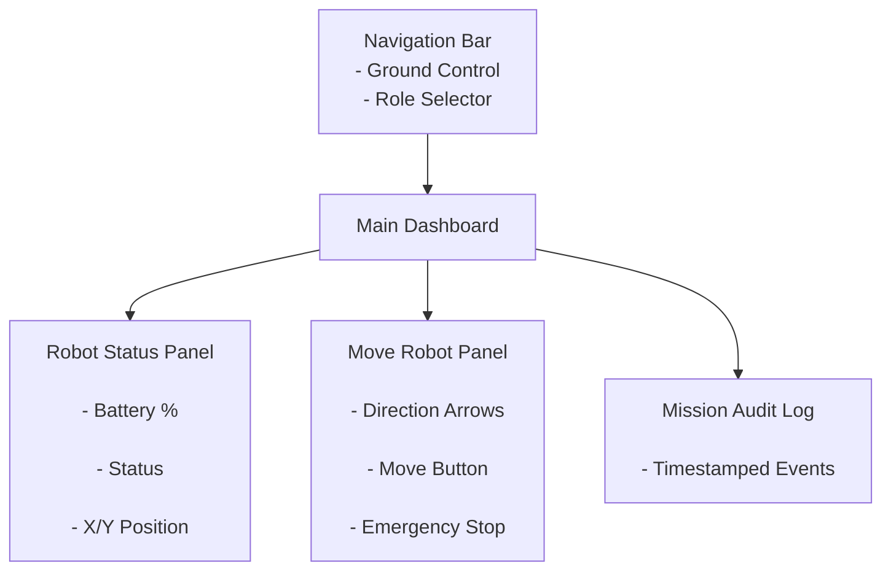
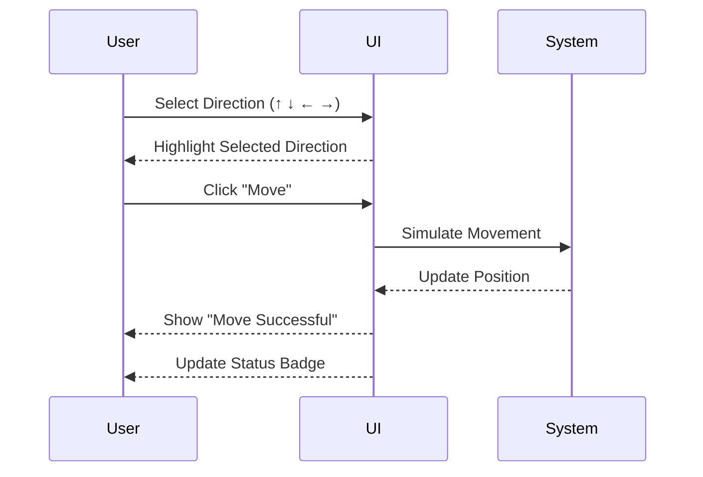

# Ground Control Station – Low Fidelity Wireframe

## Main Dashboard Layout

## Deep Dive – Move Robot Interaction

## Fitts’s Law Consideration

Primary action buttons ("Move" and "Emergency Stop") are large and centrally positioned to reduce movement time and improve accessibility.

The Emergency Stop button is visually distinct and easily reachable to support safety-critical operation.

# Task 2 – Heuristic Evaluation

## Peer Evaluation Summary

Two peers reviewed the wireframe and provided the following feedback:

Peer 1:
- It was not immediately obvious that a direction must be selected before clicking "Move".
- The current user role was not visually prominent enough.

Peer 2:
- The Emergency Stop button should stand out more due to its safety-critical nature.
- More visible confirmation feedback is needed after robot movement.

---

## AI Heuristic Evaluation (Norman & Shneiderman)

The interface was evaluated against Norman’s 7 Principles and Shneiderman’s 8 Golden Rules.

### Identified Usability Issues

1. Visibility of System Status  
   The original layout did not clearly indicate whether the robot was actively moving or idle after clicking "Move".

2. Error Prevention  
   There was no clear constraint preventing users from clicking "Move" without selecting a direction first.

3. Consistency & Feedback  
   The role indicator was present but lacked strong visual emphasis, which may reduce clarity for multi-role systems.

---

## Design Improvements Implemented

1. Added visible status badges that change dynamically.
2. Implemented logic preventing movement without direction selection.
3. Enhanced Emergency Stop prominence and button sizing.
4. Improved visual hierarchy for role display.
5. Added clear success notifications after actions.

These refinements improved usability, feedback clarity, and error prevention while aligning with established HCI principles.
