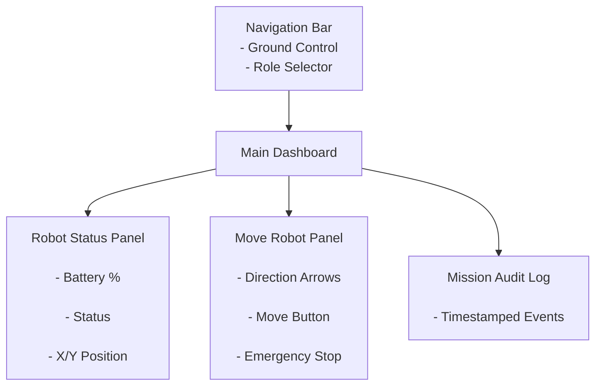
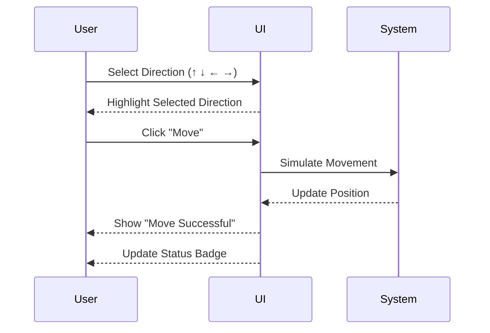

# Ground Control Station – Low Fidelity Wireframe

## Main Dashboard Layout

## Deep Dive – Move Robot Interaction

## Fitts’s Law Consideration

Primary action buttons ("Move" and "Emergency Stop") are large and centrally positioned to reduce movement time and improve accessibility.

The Emergency Stop button is visually distinct and easily reachable to support safety-critical operation.
